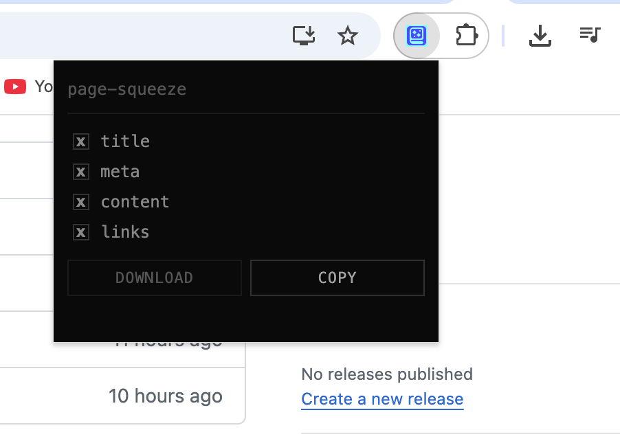

# page-squeeze

A Chrome extension that squeezes webpages into clean markdown and downloads it as a `.md` file.

## Installation

**Install from Chrome Web Store (Recommended)**

You can now install page-squeeze directly from the [Chrome Web Store](https://chromewebstore.google.com/detail/page-squeeze/abjniaameijmdllhhpbfbppfnklhjj) for free.

**Manual Installation**

1. Open Chrome and navigate to `chrome://extensions/`
2. Enable **Developer mode** (top-right toggle)
3. Click **Load unpacked**
4. Select the `extension/` folder from this project

## Usage

1. Navigate to any webpage you want to squeeze
2. Click the **page-squeeze** icon in the toolbar
3. Toggle sections you want included (title, meta, content, links)
4. Click **extract**
5. The markdown file will download with a filename based on the page's hostname and path

## Output Format

```markdown
# [Page Title]

# META
- **description**: ...
- **author**: ...
- **og:title**: ...

# CONTENT
[Clean extracted text content]

# LINKS
- [Link text](https://...)
```


